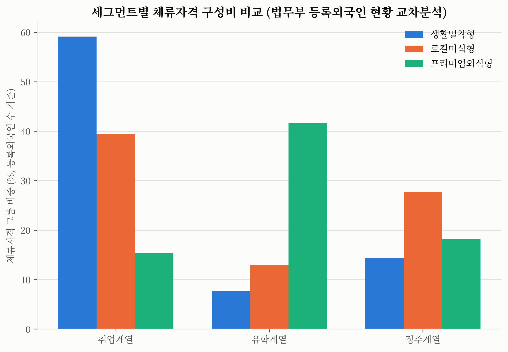
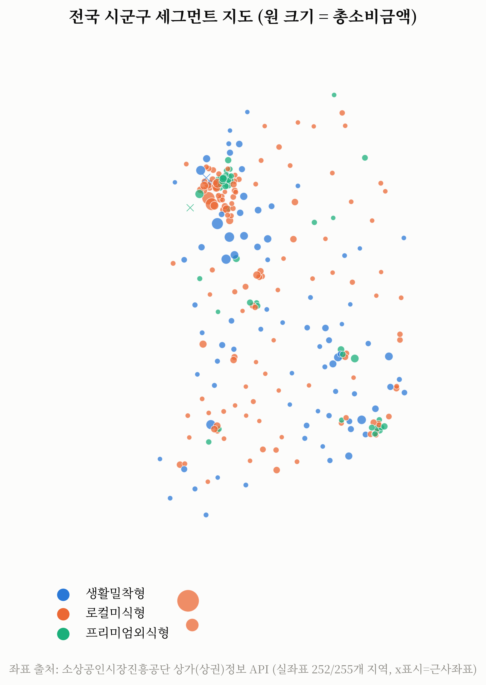
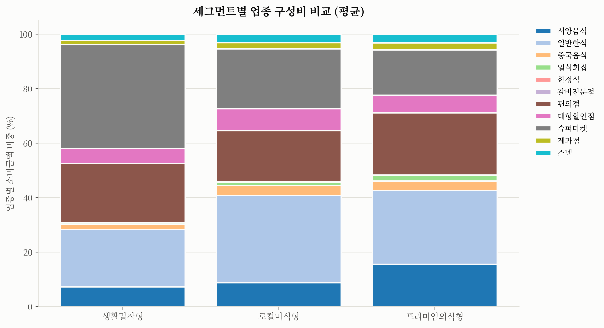
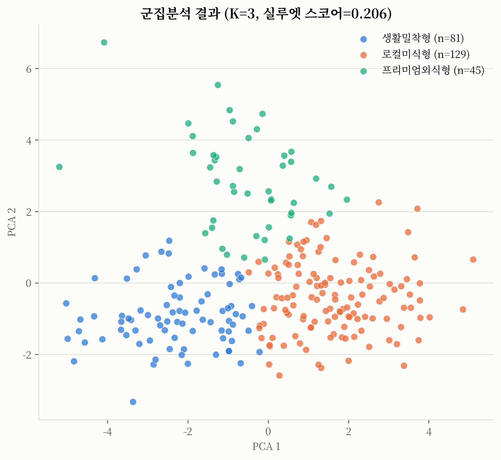

# 📌 거주형-관광형 외국인 소비 3대 세그먼트 발굴과 맞춤 상권 전략

> BC카드 소비데이터와 법무부 체류자격 데이터를 교차분석해 외국인 소비 안에 섞여 있는 성격이 다른 3개 하위 세그먼트를 데이터로 분리하고 실체를 검증한 프로젝트입니다.

<br>

## Overview

비씨카드 「제1회 AI금융빅데이터플랫폼 소비데이터 활용 분석·아이디어 공모전」 출품을 위해 진행했습니다.

카드데이터의 `GENDER_CD='3'`(외국인) 소비는 지금까지 하나의 덩어리로 다뤄졌지만, 실제로는 **장기거주 근로자**와 **단기 관광객**이 뒤섞여 있을 것이라는 가설에서 출발했습니다. 
이 두 집단은 업종 소비 구성, 연령대, 건당 결제금액이 근본적으로 다를 수밖에 없고 이를 구분하지 못하면 "외국인 상권 전략"은 실제로는 누구를 위한 것인지 불분명한 뭉뚱그려진 전략이 됩니다.

목적은 두 가지입니다.

1. 시군구 단위 소비 패턴을 군집분석해 성격이 다른 3개 세그먼트를 재현 가능한 알고리즘으로 분리한다.
2. 카드데이터만으로는 "추정"에 머무르는 세그먼트의 실체를, 법무부 체류자격 데이터로 교차검증해 "검증된 사실"로 격상시킨다 (예: 특정 세그먼트가 실제로 취업비자 소지자가 많은 지역인지).

<br>

## Approach

### 사용한 데이터

| 데이터 | 출처 | 비고 |
|---|---|---|
| 전국 시군구별 업종별 소비 집계데이터 (2026.1~6, 242,574행) | 비씨카드 (공모전 필수 제공 데이터) | `data/raw/` |
| 등록외국인 지역별 현황 (시군구×체류자격, 2026.6말 기준) | 법무부 출입국, 외국인정책본부 통계월보 | 공공누리 4유형, 카드데이터 마지막 집계월과 시점 일치 |
| 상가(상권)정보 — 시군구 실좌표 | 소상공인시장진흥공단 (공공데이터포털 Open API) | 지도 시각화 좌표 보정용, 인증키 및 개인정보 미포함 |
| 「방한 외국인 소비 트렌드 보고서」(2026.7) | 비씨카드 데이터분석팀 | 참고용, 다루는 업종이 대회 데이터와 불일치하기 때문에 분석 근거로 사용하지 않음 |

### 주요 전처리 및 분석 방법

- **스키마 실측 검증**: 공식 안내문서와 실제 데이터 간 3가지 불일치(컬럼명 대소문자, 외국인 연령대 존재 여부, 업종명 공백)를 assert로 고정하고 전처리에 반영
- **시군구 복합키 처리**: "중구"·"동구"·"서구" 등 7개 시군구명이 여러 광역시도에 중복 존재 → `(SIDO_NM, CCG_NM)` 복합키로만 groupby
- **피처 엔지니어링**: 시군구 단위로 업종 11종·연령 6종 소비 비중(%), 총소비금액/건수, 건당 평균결제금액, 월별 변동계수(CV), 저표본(low_sample) 플래그 생성
- **통계 검정**: Mann-Whitney U(2집단), Kruskal-Wallis(3집단) 비모수 검정으로 세그먼트 간 차이를 p-value와 함께 검증 (정규성을 가정할 수 없는 비중 데이터 특성 반영)
- **행정구역 매핑**: 카드데이터 ↔ 법무부 데이터 지역명 매핑 테이블 작성, 조인 성공률 100% (255/255) 확보 후 진행

### 사용한 모델 또는 기술

- **규칙기반 스코어링**: 업종 비중으로 생활밀착지수·한식지향지수·양식지향지수 정의 → 1차 라벨링
- **K-means 군집분석**: 업종 11차원+연령 6차원을 `StandardScaler` 표준화 후 군집화, K는 실루엣 스코어(K=2~8 전수 탐색)로 결정(K를 강제하지 않음, 
  `random_state=42` 고정) → 실측 결과 K=3이 전 구간 최댓값(0.206)으로 최적 확인
- **K 선택 강건성 검증**: 실루엣 스코어만으로는 K=3(0.206)과 K=7(0.203) 격차가 근소해 근거가 얕았음 
  → 부트스트랩 서브샘플링 안정성(ARI)을 추가 검증해 K=3(0.905)이 K=7(0.606)보다 훨씬 재현 안정적임을 확인, 
    안정성 1위 K=2(0.915)는 프리미엄외식형을 두 군집에 흩어버려(27:18) 세 번째 성격을 표현하지 못함도 함께 확인 (`notebooks/03_segmentation.ipynb` §3-3b)
- **법무부 데이터 저표본 강건성 검증**: 등록외국인 총합계가 지역별로 1명~40,479명까지 편차가 커 하위 10분위(25개 지역) 제외 후 재검정 
  → 핵심 가설(취업계열 비중 차이)이 오히려 더 강해짐 (p=4.07×10⁻¹²→1.21×10⁻¹⁴) (`notebooks/04_external_validation.ipynb` §4-4b)
- **PCA**: 군집 결과를 2차원으로 축소해 산점도 시각화

### 전체적인 접근 방식

```
01 데이터 탐색 → 02 전처리 → 03 세그먼트 분류(규칙기반+군집분석 상호검증)
→ 04 법무부 데이터 교차검증(가설 통계검정) → 05 세그먼트 심층비교(이상치 케이스)
→ 06 시각화
```

노트북 01→06이 순차적으로 재현 가능하도록 구성했고, 모든 핵심 로직은 `src/`에 모듈화해
노트북에서는 import만 하도록 분리했습니다.

<br>

## Results

### 3대 세그먼트

| 세그먼트 | 지역 수 | 핵심 특징 | 건당 평균결제금액 |
|---|---|---|---|
| **생활밀착형** (거주 중심) | 81곳 | 슈퍼마켓+편의점+대형할인점 65.5%, 낮은 월별 변동성(CV 0.08) | 18,277원 |
| **로컬미식형** (관광 중심) | 129곳 | 일반한식 32.1% 압도적, 50대+60대이상 비중 45.4%(최고) | 18,402원 |
| **프리미엄외식형** (관광 중심) | 45곳 | 서양음식 15.6%(최고), 20대 비중 27.7%(최고) | 14,640원 |

### 핵심 통계 검정 결과 (법무부 체류자격 데이터 교차검증)

| 가설 | 검정 | 결과 |
|---|---|---|
| 생활밀착형은 취업계열 체류자격 비중이 유의하게 높다 | Mann-Whitney U | 59.1% vs 33.2%, **p = 4.07×10⁻¹²** |
| 생활밀착형은 유학계열 체류자격 비중이 유의하게 낮다 | Mann-Whitney U | 7.6% vs 20.3%, **p = 1.23×10⁻⁵** |
| 생활밀착형은 정주계열 체류자격 비중이 유의하게 낮다 | Mann-Whitney U | 14.3% vs 25.3%, **p = 4.23×10⁻¹⁰** |
| 업종·연령 구성비가 세그먼트 간 유의하게 다르다 | Kruskal-Wallis | 11개 업종 중 9개, 6개 연령대 전부 p<0.05 |
| 월별 변동성(CV)이 세그먼트 간 다르다 | Kruskal-Wallis | p = 0.937 — **유의하지 않음** |
| 법무부 저표본 25곳 제외 후에도 취업계열 차이 유지 | Mann-Whitney U | 58.3% vs 29.4%, **p = 1.21×10⁻¹⁴** |

### 주요 인사이트

- 카드데이터만으로는 **추정**이던 "생활밀착형=근로자 밀집지역"이라는 가설이 법무부 데이터로 **검증된 사실**로 격상됨 (p<10⁻¹¹).
- **50대+60대이상 외국인 소비 비중이 34.8%로 20대(18.4%)보다 크다** — "외국인 관광=젊은층"이라는 통념과 다른 시그널이며, 특히 로컬미식형(45.4%)에서 두드러짐.
- **"프리미엄외식형"이라는 이름과 달리 건당 평균결제금액은 세 세그먼트 중 가장 낮음**(14,640원). 서양음식 비중은 가장 높지만 객단가는 낮아, 고가 전략보다 볼륨 전략이 데이터에 부합.
- 규칙기반 vs 군집분석 라벨 일치도는 48.6%에 그침 — 업종 비중 2개 지수만 보는 단순 지표보다 17차원을 종합하는 군집분석이 훨씬 정교하게 지역을 구분한다는 근거.
- 영등포구(중국음식 27.9%, 세그먼트 평균의 7.7배)·과천시(일반한식 50.7%) 등 세그먼트 평균을 크게 벗어나는 국지적 편중 사례 확인.

### 시각화

| 세그먼트별 체류자격 구성비 (핵심 검증 결과) | 전국 시군구 세그먼트 지도 |
|---|---|
|  |  |

| 세그먼트별 업종 구성비 | 군집분석 결과 (PCA) |
|---|---|
|  |  |

전체 7종 차트는 [`results/figures/`](results/figures/)에서 확인할 수 있고, 
인터랙티브 지도는 [`results/figures/07_segment_map.html`](results/figures/07_segment_map.html)에 별도로 있습니다.

### 비즈니스 아이디어 

각 아이디어는 근거 지표, 기대효과, 한계점을 포함합니다. 전체 내용은 [`docs/아이디어요약서.md`](docs/아이디어요약서.md) 참조.

1. **생활밀착형** — 취업계열 근로자 대상 "급여주기 연동" 생필품 정기결제 리워드
2. **생활밀착형** — 다국어 생필품 픽업 로커 + 소상공인 공동물류
3. **로컬미식형** — 시니어 외국인 특화 한식 미식투어 상품
4. **로컬미식형** — 지역 편중 업종 기반 국지적 소상공인 매칭 프로모션
5. **프리미엄외식형** — 유학생 학기초 웰컴 바우처 (대학가 양식·일식 가맹점 연계)
6. **프리미엄외식형** — 다국적 미식 신용카드 제휴 혜택 (양식·일식 특화)

<br>

## Limitations

- **F-4(재외동포) 미포함**: 법무부 등록외국인 통계는 외국인등록 제도 기준이며, 재외동포(F-4)는 국내거소신고로 별도 관리되어 교차분석에 반영되지 않음 
  (정주계열 비중이 실제보다 과소 추정되었을 가능성)
- **지역 개념의 불일치**: 카드데이터는 "소비 발생 지역", 법무부 데이터는 "등록 거주지" 기준이라 관광객처럼 거주지와 소비지가 다른 경우 완전히 같은 지역을 가리키지 않을 수 있음.
- **행정구역 개편 시차**: 지도 시각화에 쓴 소상공인 상가정보 API(2026.6 기준)에는 카드데이터 수집 이후의 행정구역 개편(광주+전남 통합, 인천 일부 구 개편)이 이미 반영되어 있어, 
  인천 3개 구(중구, 동구, 서구)는 실좌표를 구하지 못해 근사좌표로 대체함.

<br>

## How to Run

```bash
# 1) 의존성 설치
pip install -r requirements.txt

# 2) 원본 데이터 배치 (보안관리 서약 대상이므로, git 미포함)
#    data/raw/ABP_CONTEST_DATA.csv 위치에 BC카드 원본 CSV 배치

# 3) 노트북을 01 -> 06 순서대로 순차 실행
jupyter nbconvert --to notebook --execute --inplace notebooks/01_data_exploration.ipynb
jupyter nbconvert --to notebook --execute --inplace notebooks/02_preprocessing.ipynb
jupyter nbconvert --to notebook --execute --inplace notebooks/03_segmentation.ipynb
jupyter nbconvert --to notebook --execute --inplace notebooks/04_external_validation.ipynb
jupyter nbconvert --to notebook --execute --inplace notebooks/05_analysis.ipynb
jupyter nbconvert --to notebook --execute --inplace notebooks/06_visualization.ipynb
```

`src/` 각 모듈은 `python src/<모듈명>.py`로 단독 실행도 가능합니다(스모크 테스트용).

`data/external/store_centroids.csv`(지도 실좌표 캐시)는 이미 저장소에 포함되어 있어 노트북 06은 API 호출 없이 바로 실행됩니다. 캐시를 재생성하려면 공공데이터포털 서비스키를 환경변수로 전달합니다.

```bash
DATA_GO_KR_SERVICE_KEY=발급받은키 python src/store_data.py
```

<br>

## Tech Stack

### Languages  

### Data Analysis    

### Machine Learning  

### Visualization    

### Development & Environment        

### Open Data / API  

<br>

## Project Structure

```text
.
├── README.md
├── requirements.txt
├── .gitignore                         
├── data/
│   ├── raw/   # BC카드 원본 (git 미포함)
│   ├── external/   # 법무부·소상공인시장진흥공단 공공데이터
│   ├── reference/                    
│   └── processed/
│       └── foreign_consumption_clean.csv
├── notebooks/
│   ├── 01_data_exploration.ipynb
│   ├── 02_preprocessing.ipynb
│   ├── 03_segmentation.ipynb
│   ├── 04_external_validation.ipynb
│   ├── 05_analysis.ipynb
│   └── 06_visualization.ipynb
├── src/
│   ├── data_loader.py  # Step 1: 로딩 & 스키마 검증
│   ├── preprocessing.py   # Step 1: 정제 & 외국인 필터링
│   ├── feature_engineering.py   # Step 2: 시군구별 특징 벡터
│   ├── scoring.py   # Step 3: 규칙기반 + 군집분석 세그먼트 분류
│   ├── external_data.py   # Step 4: 법무부 데이터 로딩 및 통계검증
│   ├── region_mapping.py   # Step 4: 행정구역명 매핑
│   ├── store_data.py   # Step 7: 지도용 시군구 실좌표 수집(공공API)
│   └── visualize.py   # Step 7: 시각화
├── results/
│   ├── figures/                   
│   ├── segment_classification.csv   # 시군구별 세그먼트 라벨
│   ├── segment_visa_validation.csv   # 세그먼트별 체류자격 통계검증
│   └── segment_visa_validation_robustness.csv   # 법무부 저표본 제외 재검정(강건성 검증)
└── docs/
    └── 아이디어요약서.md
```

<br>

## License

Copyright © 2026 Hyunjin.Hwang. All rights reserved.

This repository is provided for viewing and portfolio evaluation purposes only.

No permission is granted to copy, modify, distribute, sublicense, publish, or commercially use any part of this project, including its source code, assets, documentation, design, or other contents, without prior written permission from the copyright holder.

If you want to use this project or any portion of it, please obtain written permission from the repository owner in advance.
